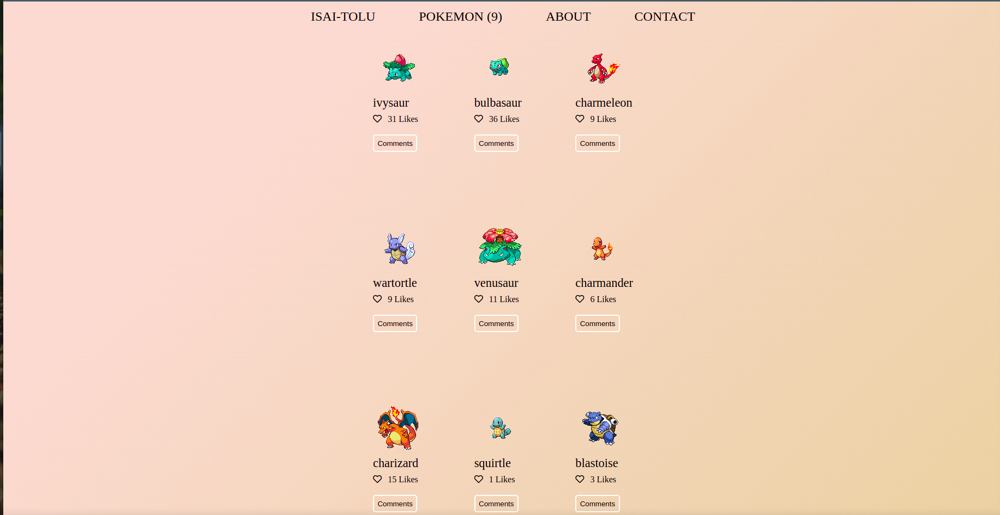

# Capstone-Module-2
## Javascript Capstone Project- API-Based WebApp

The JavaScript capstone project is about building a web application based on an external API. We selected an API that provides data about Pokemon and then build the webapp around it. The webapp has 2 user interfaces:
- A home page showing a list of items that you can "like."
- A popup window with more data about an item that you can comment on it or reserve it for a period of time.

## Built With

- HTML5
- CSS3
- Javascript ES6
- Jest
## Live Demo

[Live Demo Link](https://zealous-jang-8bec9e.netlify.app/)

## To get a local copy run the following steps:
- Copy this link [this link](https://github.com/Lordkaito/capstone-module-2)
- Open your terminal or command line
- Run "git clone Paste [this link](https://github.com/Lordkaito/capstone-module-2)"
- Open the folder with your code editor
- Create a branch to work on
- Run `npm run build`
- Run `npm start` to start the server
- Or open the `index.html` file in the dist directory with liveserver

## Authors

👤 **Author1**

- Name: Ajise Toluwase
- GitHub: [@githubhandle](https://github.com/Whoistolu)
- Twitter: [@twitterhandle](https://twitter.com/Littletolu)
- LinkedIn: [LinkedIn](https://www.linkedin.com/in/toluwase-ajise-9b40411b2/)

👤 **Author2**

- Name: Isaí Céspedes Sánchez
- GitHub: [@githubhandle](https://github.com/Lordkaito)
- Twitter: [@twitterhandle](https://twitter.com/Lordkaito_)
- LinkedIn: [LinkedIn](https://www.linkedin.com/in/isai-c%C3%A9spedes-4164a51b4/)

## 🤝 Contributing

Contributions, issues, and feature requests are welcome!

## Show your support

Give a ⭐️ if you like this project!

## Acknowledgments

- Hat tip to anyone whose code was used
- Inspiration
- etc

## 📝 License

This project is [MIT](./MIT.md) licensed.

